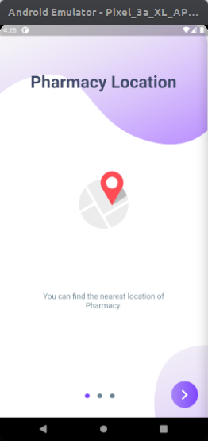
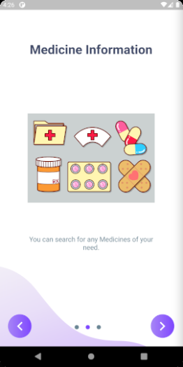
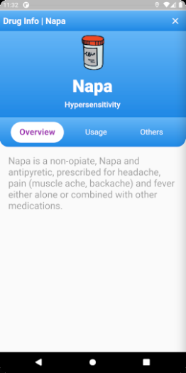
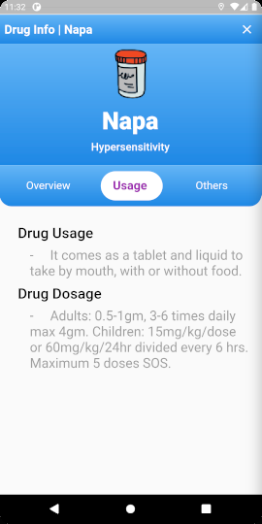
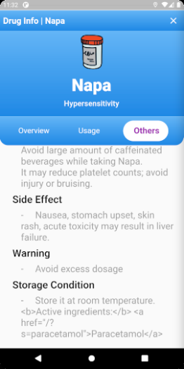
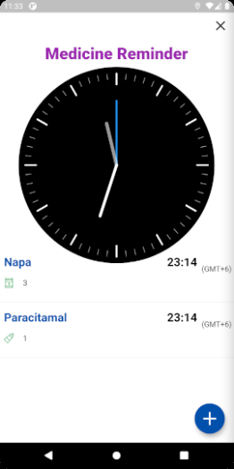
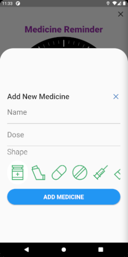
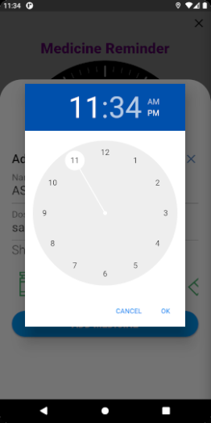
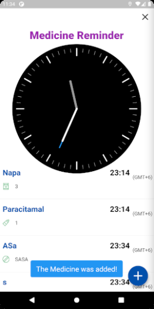

# med_easy

**API URL :**

    http://localhost/api/*

**Login:**

    email : mh@g.co
    password : 123456

**Flutter Version :**

    Flutter 1.17.4 • channel stable • https://github.com/flutter/flutter.git
    Framework • revision 1ad9baa8b9 (6 months ago) • 2020-06-17 14:41:16 -0700
    Engine • revision ee76268252
    Tools • Dart 2.8.4

 

 

 

 

 

 

 

 

 

